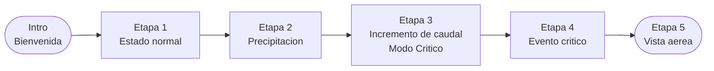

# SATCS — Overview del Proyecto

## ¿Qué es SATCS?

**Sistema de Alerta Temprana Comunitaria (SATCS)** es una experiencia educativa interactiva en realidad aumentada que corre en el navegador web. Fue desarrollado para la **Institución Universitaria Pascual Bravo** en Medellín.

Su objetivo es enseñar a la comunidad cómo funcionan los sistemas de alerta temprana ante riesgos hídricos (quebradas, inundaciones) en barrios urbanos.

---

## ¿Qué hace el jugador?

El jugador camina virtualmente por un barrio (usando su teléfono o computador) y:

1. Explora el entorno en primera persona
2. Se acerca a puntos de interés (**hotspots**) en el barrio
3. Interactúa con vecinos (NPC), llama al SIATA, ve cinemáticas explicativas
4. Toma decisiones correctas para avanzar por 5 etapas narrativas
5. En las etapas críticas recibe alertas visuales y sonoras
6. Al final (Etapa 5) observa el impacto del evento desde una vista aérea

---

## Plataforma y tecnología

| Aspecto | Detalle |
|---|---|
| Motor | Unity 2022.3.55f1 |
| Plataforma de salida | WebGL (navegador web) |
| Lenguaje | C# |
| Renderizado | URP / modo skybox |
| AR manual | GPS + giroscopio del dispositivo (sin ARFoundation) |

**No usa ARFoundation.** La AR se construye manualmente:
- El **GPS** del teléfono posiciona al jugador en el mundo 3D
- El **giroscopio** rota la cámara según hacia dónde mira el usuario
- En PC: el teclado (WASD) mueve al jugador y el mouse rota la cámara

---

## Escenarios disponibles

El GDD define 3 barrios:

| Escenario | Quebrada |
|---|---|
| Olaya Herrera | Quebrada La Iguaná |
| La Cantera Sur | Quebrada La Cantera Ramal Sur |
| San Antonio de Prado | Santa Rita, Quebrada la Maria |

La escena actualmente activa es **CASAS_OLAYA**.

---

## Las 5 Etapas

Cada escenario recorre 5 estados progresivos del mismo barrio:

| Etapa | Nombre | Descripción |
|---|---|---|
| Intro | Bienvenida | Pantalla de onboarding antes de empezar |
| Etapa 1 | Estado normal | Barrio tranquilo, primeros hotspots informativos |
| Etapa 2 | Precipitación | Lluvia leve, cambios visuales sutiles |
| Etapa 3 | Incremento de caudal | Alerta temprana, modo crítico activado |
| Etapa 4 | Evento crítico | Situación de emergencia, decisiones urgentes |
| Etapa 5 | Vista aérea | Observación del impacto desde arriba |

---

## ¿Para quién es esta documentación?

Esta documentación está dirigida a:
- Desarrolladores que se incorporan al proyecto
- Diseñadores que quieren agregar contenido (hotspots, diálogos, etapas)
- Estudiantes o colaboradores sin experiencia avanzada en Unity

**No se necesita experiencia avanzada en Unity para agregar contenido al juego.** La mayoría de los datos se configuran mediante ScriptableObjects en el Inspector, sin escribir código.
