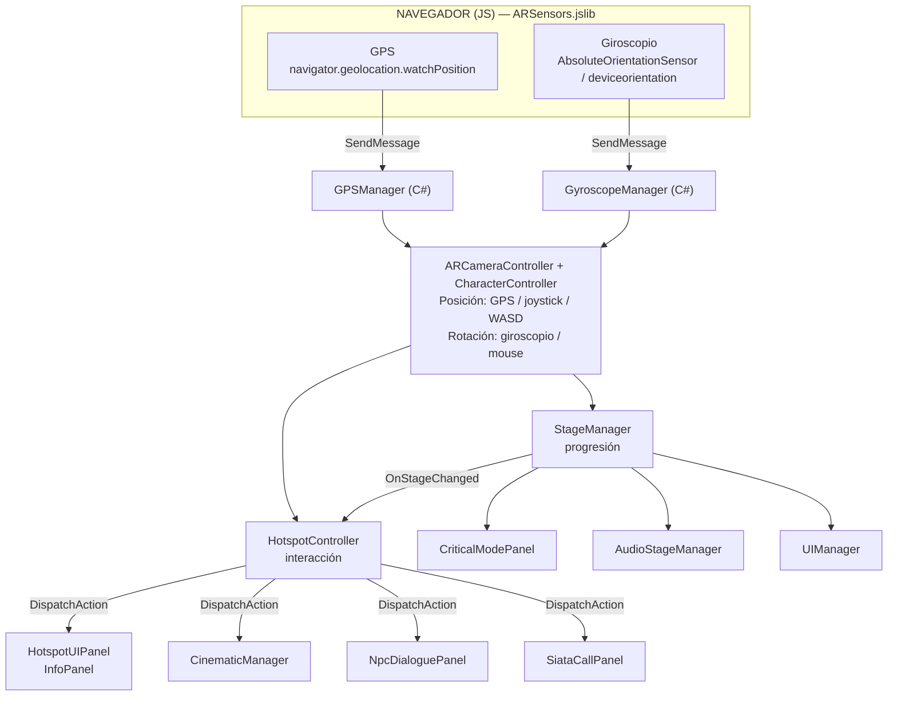
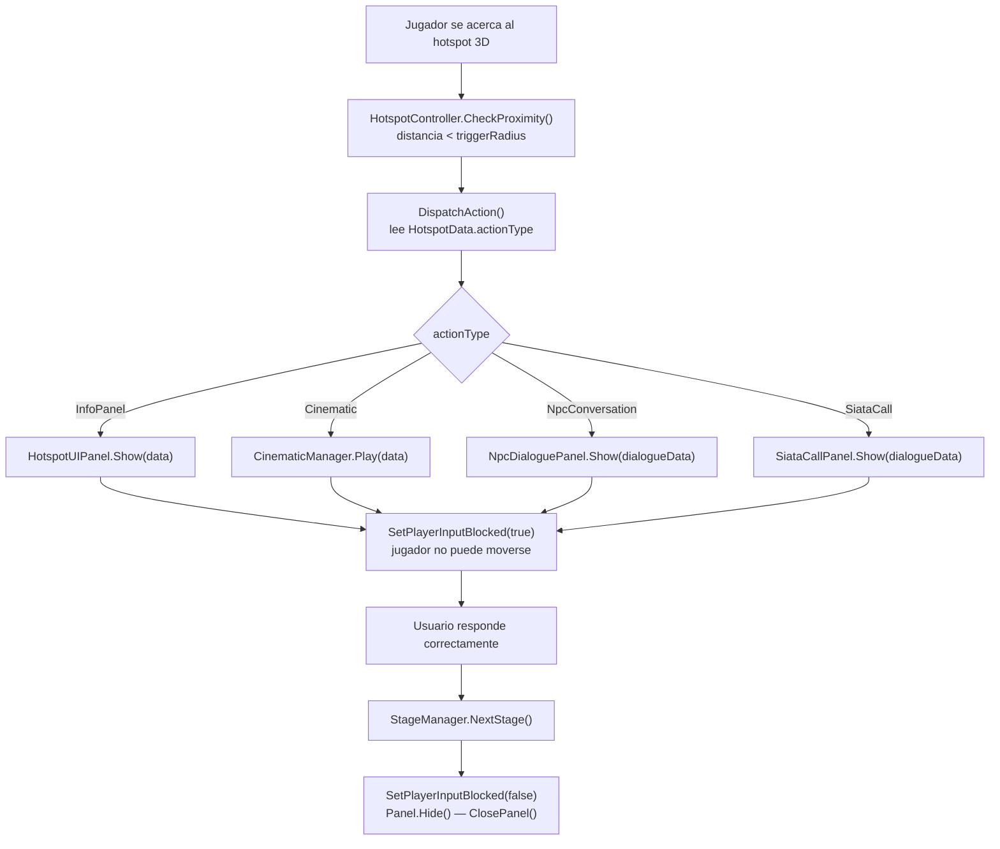

# SATCS — Arquitectura del Sistema

## Visión general

El proyecto está dividido en capas que se comunican entre sí mediante eventos. Ningún sistema necesita conocer los detalles internos de los otros — solo escuchan eventos o llaman a APIs públicas.



---

## Patrones de diseño usados

### Singleton
Los managers principales son Singletons con `DontDestroyOnLoad`. Se acceden desde cualquier script mediante `NombreClase.Instance`.

```
GPSManager.Instance
GyroscopeManager.Instance
StageManager.Instance
CinematicManager.Instance
CriticalModePanel.Instance
AudioStageManager.Instance
NpcDialoguePanel.Instance
SiataCallPanel.Instance
SensorCalibrationPanel.Instance
```

### Eventos C# (Action<T>)
Los sistemas se comunican sin acoplamiento directo. El principal es:

```csharp
StageManager.Instance.OnStageChanged += MiMetodo;
// Firma: (Stage anterior, Stage nueva)
```

Suscriptores actuales: `HotspotController`, `UIManager`, `CriticalModePanel`, `AudioStageManager`.

### ScriptableObjects
Los datos de contenido (hotspots, diálogos) se guardan como assets independientes. Esto permite cambiar el contenido sin tocar el código.

```
HotspotData     → Assets > Create > AR > Hotspot Data
NpcDialogueData → Assets > Create > AR > NPC Dialogue Data
```

### jslib (JavaScript ↔ Unity)
Los sensores del navegador (GPS, giroscopio) no son accesibles desde C# directamente. Se usa un plugin JavaScript (`ARSensors.jslib`) que envía los datos a Unity mediante `SendMessage`.

---

## Módulos del sistema

### Módulo de Sensores
Maneja la comunicación con el hardware del dispositivo.

| Script | Función |
|---|---|
| `ARSensors.jslib` | Plugin JS que accede a GPS y giroscopio del navegador |
| `GPSManager` | Recibe GPS, calcula posición en metros (Haversine) |
| `GyroscopeManager` | Convierte ángulos del giroscopio a rotación Unity |

### Módulo de Cámara / Movimiento
Controla cómo el jugador se mueve y mira.

| Script | Función |
|---|---|
| `ARCameraController` | Aplica GPS/joystick/WASD al movimiento; giroscopio/mouse a la rotación |
| `JoystickController` | Joystick táctil en pantalla para móviles sin GPS |
| `CharacterController` | Componente Unity que maneja colisión con el terreno y gravedad |

### Módulo de Progresión
Controla en qué etapa está el jugador y qué está activo.

| Script | Función |
|---|---|
| `StageManager` | Enum de etapas, GoToStage(), NextStage(), OnStageChanged |
| `WelcomePanel` | Pantalla de onboarding inicial antes de Etapa1 |

### Módulo de Hotspots
Los puntos de interés del mundo 3D.

| Script | Función |
|---|---|
| `HotspotData` | ScriptableObject con el contenido del hotspot |
| `HotspotController` | Detecta proximidad/clic y lanza la acción correspondiente |
| `HotspotUIPanel` | Panel de texto simple (InfoPanel) |

### Módulo de Interacción
Los paneles que aparecen al activar un hotspot.

| Script | Función |
|---|---|
| `NpcDialoguePanel` | Conversación con NPC con opciones de respuesta |
| `SiataCallPanel` | Simulación de llamada al SIATA |
| `MultipleChoicePanel` | Botones A/B/C reutilizados por los paneles de arriba |
| `CinematicManager` | Video fullscreen con botón Skip |

### Módulo de Retroalimentación Ambiental
Reacciona automáticamente a los cambios de etapa.

| Script | Función |
|---|---|
| `CriticalModePanel` | Modal de alerta en Etapa3/4 |
| `AudioStageManager` | Música/ambiente con crossfade por etapa |

### Módulo de UI / Calibración
Interfaz general del jugador.

| Script | Función |
|---|---|
| `UIManager` | HUD con estado GPS/giroscopio, toggle joystick |
| `SensorCalibrationPanel` | Ajuste manual del giroscopio |

---

## Flujo de datos de un hotspot


