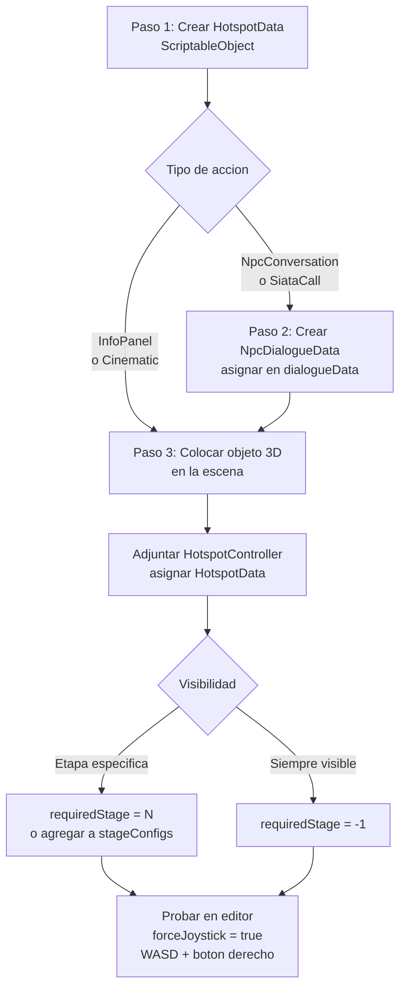

# SATCS — Flujo de Trabajo

Guías prácticas para las tareas más comunes del proyecto.

---

## Agregar un Hotspot nuevo

Un hotspot es un punto de interés en la escena 3D que el jugador activa por proximidad o clic.



### Paso 1 — Crear el ScriptableObject HotspotData

1. En **Project**, ir a la carpeta `Assets/Hotspot/` (o donde estén los hotspots existentes)
2. Clic derecho → **Create > AR > Hotspot Data**
3. Nombrar el asset (ej: `HS_VecinoJuan_Etapa1`)
4. Configurar en Inspector:

   | Campo | Ejemplo |
   |---|---|
   | Title | "Vecino Juan" |
   | Description | "¿Sabes qué hacer cuando suena la alarma?" |
   | Action Type | `NpcConversation` |
   | Required Stage | `1` (solo visible en Etapa1) |
   | Trigger Radius | `5` |
   | Is Blinking | ✓ |

### Paso 2 — Crear el diálogo (si es NpcConversation o SiataCall)

1. Clic derecho → **Create > AR > NPC Dialogue Data**
2. Nombrar (ej: `Dialogue_VecinoJuan`)
3. Configurar:

   ```
   NPC Name: "Juan, vecino del barrio"
   NPC Text: "¿Cuál es el primer paso al escuchar la alarma del SIATA?"
   Advances Stage On Correct: ✓
   Correct Answer Delay: 1.5

   Options[0]: "Llamar a la familia" — isCorrect: ✗ — Feedback: "No olvides..."
   Options[1]: "Evacuar hacia la ruta segura" — isCorrect: ✓ — Feedback: "¡Correcto! La ruta..."
   Options[2]: "Quedarse en casa" — isCorrect: ✗ — Feedback: "Esto puede ser peligroso..."
   ```

4. En el HotspotData, asignar este asset en el campo `Dialogue Data`

### Paso 3 — Colocar el objeto 3D en la escena

1. Arrastrar un modelo 3D (o usar un cubo como placeholder) a la escena
2. Posicionarlo donde deba estar el hotspot
3. Asegurarse de que tenga un **Collider** (Box, Sphere o Mesh Collider)
4. Adjuntar script: **HotspotController**
5. En Inspector de `HotspotController`:
   - `data` → asignar el HotspotData creado en el Paso 1
   - `uiPanel` → se auto-detecta, o asignar el HotspotPanel del Canvas

### Paso 4 — Asignar al StageManager (opcional)

Si el hotspot debe aparecer/desaparecer al cambiar de etapa, agrégalo a `stageConfigs`:
- En `StageManager`, campo `stageConfigs[1]` (Etapa1)
- `objectsToActivate` → arrastrar el GameObject del hotspot

Alternativa: usar `requiredStage = 1` en `HotspotData`. El `HotspotController` se activa/desactiva automáticamente según la etapa.

---

## Agregar una cinemática

### Paso 1 — Preparar el video

- Formato recomendado: `.mp4` (H.264) para WebGL
- Para preview en editor Linux: convertir a `.webm`
- Copiar el archivo a `Assets/StreamingAssets/Videos/`

### Paso 2 — Crear el HotspotData

1. **Create > AR > Hotspot Data**
2. Configurar:
   - `Action Type` = `Cinematic`
   - `Cinematic Url` = `StreamingAssets/Videos/MiVideo.mp4`
   - `Cinematic Clip` = (opcional) el VideoClip importado para editor
   - `Cinematic Advances Stage` = ✓ (si debe avanzar etapa al terminar)

### Paso 3 — Verificar CinematicManager en escena

- Debe existir un GameObject `CinematicManager` con los scripts y el `VideoPlayer`
- El `CinematicPanel` debe estar en el Canvas con sus referencias asignadas
- Ver `04_CREAR_ESCENA.md` paso 5.7

---

## Crear un diálogo con el SIATA

Similar a NpcConversation pero con apariencia de llamada telefónica.

1. Crear `NpcDialogueData` (igual que antes)
2. En `HotspotData`, asignar `Action Type = SiataCall`
3. Asignar el NpcDialogueData en `Dialogue Data`
4. El `SiataCallPanel` mostrará automáticamente "Llamando…" durante `connectingDelay` segundos antes de mostrar las opciones

---

## Configurar el audio por etapa

1. Seleccionar el GameObject `AudioStageManager` en la escena
2. En Inspector, expandir `stageAudios`:
   - `[0]` Intro: asignar clip de ambiente tranquilo, volume 0.4
   - `[1]` Etapa1: clip ambiente barrio normal, volume 0.5
   - `[2]` Etapa2: clip lluvia leve, volume 0.5
   - `[3]` Etapa3: clip alarma + lluvia, volume 0.7, fadeTime 0.5
   - `[4]` Etapa4: clip alarma máxima, volume 0.8, fadeTime 0.3
   - `[5]` Etapa5: clip post-evento, volume 0.5

Para reproducir un sonido puntual (ej: trueno) desde cualquier script:
```csharp
AudioStageManager.Instance.PlaySFX(miClip);
```

---

## Configurar qué aparece en cada etapa

El `StageManager` puede activar/desactivar GameObjects automáticamente al cambiar de etapa.

1. Seleccionar `StageManager` en la escena
2. Expandir `stageConfigs`
3. Para cada etapa:
   - `objectsToActivate[]` → objetos que aparecen al entrar a esta etapa
   - `objectsToDeactivate[]` → objetos que desaparecen

**Ejemplo para Etapa3 (lluvia fuerte):**
```
stageConfigs[3] — Etapa3
  objectsToActivate:   [LluviaFuerte, NivelAgua_Alto, AlarmaVisual]
  objectsToDeactivate: [LluviaLeve, NivelAgua_Normal]
```

---

## Configurar el CriticalModePanel

El modal de modo crítico ya viene preconfigurado para Etapa3 y Etapa4. Para modificarlo:

1. Seleccionar `CriticalModePanel` en la jerarquía
2. En Inspector, expandir `stageContents`:
   - `[0]` stage: Etapa3, title, description, icon
   - `[1]` stage: Etapa4, title, description, icon
3. Para agregar una etapa nueva, aumentar el tamaño del array

---

## Probar sin GPS (modo editor)

El GPS no funciona en el editor de Unity. Para probar el movimiento:

1. Seleccionar `Main Camera`
2. En `ARCameraController`, activar `Force Joystick = true`
3. Presionar **Play**
4. Controles:
   - **WASD** / **flechas**: mover
   - **Botón derecho del mouse** + arrastrar: rotar cámara
   - (En móvil se usa el joystick táctil y el giroscopio)

---

## Forzar una etapa específica al iniciar

Útil para probar una etapa sin pasar por las anteriores:

1. Seleccionar `StageManager`
2. Cambiar `startStage` a la etapa deseada (ej: `Etapa3`)
3. Presionar Play

> Recuerda volver a `Intro` antes de hacer el build final.

---

## Ajustar el giroscopio (en dispositivo real)

Si la cámara no apunta donde debería en el dispositivo:

1. En la escena, buscar el panel `SensorCalibPanel`
2. En `UIManager`, verificar que `calibrationPanelButton` apunte a un botón del HUD
3. En el dispositivo, presionar ese botón → aparecen 3 sliders (Pitch, Roll, Yaw)
4. Ajustar hasta que la cámara apunte correctamente
5. Los valores se guardan automáticamente

---

## Recalibrar el GPS

Si el jugador "se teletransportó" o el GPS perdió la señal:

```csharp
// Desde cualquier script:
ARCameraController cameraController = FindObjectOfType<ARCameraController>();
cameraController.Recalibrate();
```

O presionar el botón `recalibrateButton` en el HUD (si está asignado en `UIManager`).
