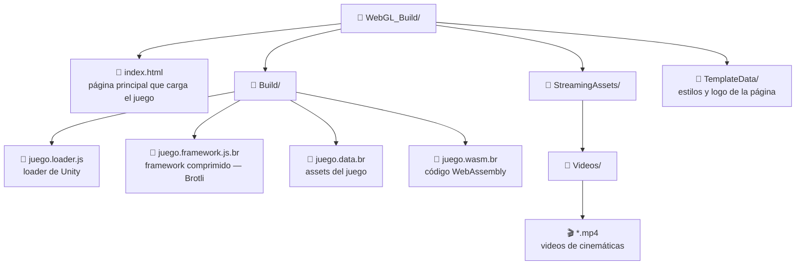

# SATCS — Guía de Despliegue

Cómo publicar el juego WebGL en un servidor para que sea accesible desde el navegador.

> **Requisito crítico:** El servidor **debe usar HTTPS**. Sin HTTPS, el GPS y el giroscopio no funcionan en Chrome ni Safari (bloqueo de seguridad del navegador). Esto no es opcional.

---

## 1. Generar el Build en Unity

Antes de subir al servidor hay que compilar el proyecto.

### 1.1 Configurar el Build

1. **File > Build Settings**
2. Seleccionar plataforma **WebGL** → clic en **Switch Platform** (puede tardar unos minutos)
3. Abrir **Player Settings** (botón en la misma ventana):

   | Sección | Campo | Valor recomendado |
   |---|---|---|
   | Resolution | Default Canvas Width/Height | 1080 × 1920 (o el que uses) |
   | Publishing | Compression Format | **Brotli** (mejor tamaño) o Gzip |
   | Publishing | Data Caching | ✓ (evita redescargar assets) |
   | Publishing | Decompression Fallback | ✓ (compatibilidad con servidores sin config especial) |

   > **Nota sobre Decompression Fallback:** Si activas esta opción, Unity incluye un decompresor en JavaScript y el build funciona en servidores sin configuración especial. La desventaja es que la primera carga es más lenta. Para producción con Nginx/Apache configurado correctamente, puedes desactivarla.

4. Cerrar Player Settings

### 1.2 Compilar

1. En **Build Settings**, clic en **Build** (o **Build And Run** para probar local)
2. Seleccionar una carpeta de salida (ej: `WebGL_Build/`)
3. Esperar — un build puede tardar 5–20 minutos la primera vez

### 1.3 Estructura del build generado



---

## 2. Opciones de Hosting

| Opción | Dificultad | Costo | HTTPS | Recomendado para |
|---|---|---|---|---|
| GitHub Pages | Baja | Gratis | Automático | Demos, pruebas |
| Hosting compartido (cPanel) | Baja | Bajo | Fácil (Let's Encrypt) | Empresa sin VPS |
| VPS (Ubuntu + Nginx) | Media | Medio | Manual (Let's Encrypt) | Producción |
| VPS (Ubuntu + Apache) | Media | Medio | Manual (Let's Encrypt) | Producción |

---

## 3. Opción A — GitHub Pages (más simple)

Ideal para demos y pruebas rápidas. HTTPS automático y gratuito.

### Limitaciones
- Tamaño máximo de repositorio: 1 GB
- No permite configurar headers personalizados de servidor (necesarios para Brotli sin Decompression Fallback)
- **Solución:** activar `Decompression Fallback` en Player Settings antes de compilar

### Pasos

1. Activar `Decompression Fallback = true` en Player Settings y recompilar
2. Crear un repositorio en GitHub (ej: `satcs-game`)
3. Subir el contenido de la carpeta `WebGL_Build/` a la rama `main` (o a una carpeta `/docs`)
4. En el repositorio → **Settings > Pages**
5. Source: **Deploy from a branch** → rama `main`, carpeta `/` (o `/docs`)
6. Guardar → en unos minutos la URL queda disponible: `https://usuario.github.io/satcs-game/`

---

## 4. Opción B — Hosting Compartido (cPanel)

La mayoría de hostings empresariales tienen cPanel con un administrador de archivos.

### Pasos

1. Acceder al **cPanel** del hosting
2. Abrir **Administrador de archivos**
3. Ir a `public_html/` (o la carpeta del dominio)
4. Crear una subcarpeta (ej: `satcs/`)
5. Subir el contenido de `WebGL_Build/` dentro de esa carpeta
6. Activar HTTPS: **cPanel > SSL/TLS > Let's Encrypt** (suele ser un clic)
7. El juego quedará en: `https://tudominio.com/satcs/`

### Configurar compresión Brotli/Gzip (archivo .htaccess)

Si el build usa compresión Brotli sin Decompression Fallback, crear un archivo `.htaccess` en la carpeta del juego:

```apache
# Servir archivos Brotli comprimidos de Unity WebGL
<IfModule mod_mime.c>
    AddEncoding br .br
    AddEncoding gzip .gz

    AddType application/octet-stream .data
    AddType application/wasm .wasm
    AddType application/javascript .js

    # Archivos Brotli
    <FilesMatch "\.data\.br$">
        ForceType application/octet-stream
        Header set Content-Encoding br
    </FilesMatch>
    <FilesMatch "\.wasm\.br$">
        ForceType application/wasm
        Header set Content-Encoding br
    </FilesMatch>
    <FilesMatch "\.framework\.js\.br$">
        ForceType application/javascript
        Header set Content-Encoding br
    </FilesMatch>
    <FilesMatch "\.loader\.js\.br$">
        ForceType application/javascript
        Header set Content-Encoding br
    </FilesMatch>
</IfModule>

# Headers de seguridad requeridos por algunos navegadores para SharedArrayBuffer
<IfModule mod_headers.c>
    Header always set Cross-Origin-Opener-Policy "same-origin"
    Header always set Cross-Origin-Embedder-Policy "require-corp"
</IfModule>
```

> Si el hosting no tiene `mod_headers` disponible, simplemente activa `Decompression Fallback` en Unity y recompila. No necesitarás este archivo.

---

## 5. Opción C — VPS con Nginx (recomendado para producción)

Control total sobre la configuración. Se asume Ubuntu 22.04.

### 5.1 Instalar Nginx

```bash
sudo apt update
sudo apt install nginx -y
sudo systemctl enable nginx
sudo systemctl start nginx
```

### 5.2 Subir el build al servidor

Desde tu computador local, copiar el build al servidor:

```bash
# Reemplaza usuario, ip-servidor y /var/www/satcs con tus datos
scp -r WebGL_Build/* usuario@ip-servidor:/var/www/satcs/
```

O con un cliente FTP/SFTP como FileZilla:
- Host: IP del servidor
- Puerto: 22
- Subir el contenido de `WebGL_Build/` a `/var/www/satcs/`

### 5.3 Configurar Nginx

Crear el archivo de configuración del sitio:

```bash
sudo nano /etc/nginx/sites-available/satcs
```

Pegar esta configuración (reemplazar `tudominio.com` con tu dominio real):

```nginx
server {
    listen 80;
    server_name tudominio.com www.tudominio.com;

    # Redirigir HTTP → HTTPS
    return 301 https://$host$request_uri;
}

server {
    listen 443 ssl http2;
    server_name tudominio.com www.tudominio.com;

    root /var/www/satcs;
    index index.html;

    # SSL — se completará con Certbot (paso 5.4)
    ssl_certificate     /etc/letsencrypt/live/tudominio.com/fullchain.pem;
    ssl_certificate_key /etc/letsencrypt/live/tudominio.com/privkey.pem;
    ssl_protocols       TLSv1.2 TLSv1.3;
    ssl_prefer_server_ciphers on;

    # Headers requeridos para SharedArrayBuffer (Unity WebGL multithreading)
    add_header Cross-Origin-Opener-Policy  "same-origin" always;
    add_header Cross-Origin-Embedder-Policy "require-corp" always;

    # Archivos Brotli de Unity WebGL
    location ~ \.wasm\.br$ {
        add_header Content-Encoding br;
        add_header Content-Type application/wasm;
    }
    location ~ \.js\.br$ {
        add_header Content-Encoding br;
        add_header Content-Type application/javascript;
    }
    location ~ \.data\.br$ {
        add_header Content-Encoding br;
        add_header Content-Type application/octet-stream;
    }

    # Archivos Gzip de Unity WebGL (si compilaste con Gzip)
    location ~ \.wasm\.gz$ {
        add_header Content-Encoding gzip;
        add_header Content-Type application/wasm;
    }
    location ~ \.js\.gz$ {
        add_header Content-Encoding gzip;
        add_header Content-Type application/javascript;
    }
    location ~ \.data\.gz$ {
        add_header Content-Encoding gzip;
        add_header Content-Type application/octet-stream;
    }

    # Videos en StreamingAssets
    location /StreamingAssets/Videos/ {
        add_header Accept-Ranges bytes;
        add_header Content-Type video/mp4;
    }

    # Cache de assets estáticos
    location ~* \.(js|css|png|jpg|svg|woff2)$ {
        expires 30d;
        add_header Cache-Control "public, immutable";
    }

    # Fallback para SPA (no aplica aquí pero es buena práctica)
    location / {
        try_files $uri $uri/ /index.html;
    }
}
```

Activar el sitio:

```bash
sudo ln -s /etc/nginx/sites-available/satcs /etc/nginx/sites-enabled/
sudo nginx -t          # verificar que no hay errores de sintaxis
sudo systemctl reload nginx
```

### 5.4 Activar HTTPS con Let's Encrypt (Certbot)

```bash
sudo apt install certbot python3-certbot-nginx -y
sudo certbot --nginx -d tudominio.com -d www.tudominio.com
```

Seguir las instrucciones en pantalla. Certbot modifica el archivo de Nginx automáticamente y configura la renovación automática del certificado.

Verificar renovación automática:
```bash
sudo certbot renew --dry-run
```

### 5.5 Permisos de la carpeta

```bash
sudo chown -R www-data:www-data /var/www/satcs
sudo chmod -R 755 /var/www/satcs
```

---

## 6. Opción D — VPS con Apache

Alternativa a Nginx si el servidor ya tiene Apache instalado.

### 6.1 Instalar Apache

```bash
sudo apt update
sudo apt install apache2 -y
sudo a2enmod headers rewrite ssl
sudo systemctl restart apache2
```

### 6.2 Subir el build

Igual que con Nginx: subir `WebGL_Build/*` a `/var/www/html/satcs/`

### 6.3 Configurar VirtualHost

```bash
sudo nano /etc/apache2/sites-available/satcs.conf
```

```apache
<VirtualHost *:80>
    ServerName tudominio.com
    Redirect permanent / https://tudominio.com/
</VirtualHost>

<VirtualHost *:443>
    ServerName tudominio.com
    DocumentRoot /var/www/html/satcs

    SSLEngine on
    SSLCertificateFile    /etc/letsencrypt/live/tudominio.com/fullchain.pem
    SSLCertificateKeyFile /etc/letsencrypt/live/tudominio.com/privkey.pem

    <Directory /var/www/html/satcs>
        AllowOverride All
        Require all granted
    </Directory>

    # Headers para SharedArrayBuffer
    Header always set Cross-Origin-Opener-Policy  "same-origin"
    Header always set Cross-Origin-Embedder-Policy "require-corp"

    # MIME types y compresión Brotli
    AddEncoding br .br
    AddType application/wasm .wasm
    AddType application/javascript .js
    AddType application/octet-stream .data

    <FilesMatch "\.wasm\.br$">
        ForceType application/wasm
        Header set Content-Encoding br
    </FilesMatch>
    <FilesMatch "\.framework\.js\.br$|\.loader\.js\.br$">
        ForceType application/javascript
        Header set Content-Encoding br
    </FilesMatch>
    <FilesMatch "\.data\.br$">
        ForceType application/octet-stream
        Header set Content-Encoding br
    </FilesMatch>
</VirtualHost>
```

```bash
sudo a2ensite satcs.conf
sudo apache2ctl configtest
sudo systemctl reload apache2
```

Instalar Certbot para Apache:
```bash
sudo apt install certbot python3-certbot-apache -y
sudo certbot --apache -d tudominio.com
```

---

## 7. Actualizar el juego (nuevo build)

Cuando hay una nueva versión del juego:

### En Nginx/Apache (VPS)
```bash
# Hacer backup del build anterior (opcional)
sudo mv /var/www/satcs /var/www/satcs_backup_$(date +%Y%m%d)

# Subir el nuevo build
scp -r WebGL_Build/* usuario@ip-servidor:/var/www/satcs/

# Restaurar permisos
sudo chown -R www-data:www-data /var/www/satcs
```

### En cPanel
1. Entrar al Administrador de archivos
2. Seleccionar los archivos antiguos → Eliminar (mantener `StreamingAssets/Videos/` si los videos no cambiaron)
3. Subir los nuevos archivos

### En GitHub Pages
```bash
# Desde la carpeta del repositorio local
cp -r WebGL_Build/* .
git add .
git commit -m "Deploy nueva versión"
git push
```

---

## 8. Checklist de verificación post-despliegue

Después de subir el build, verificar cada punto:

- [ ] La URL carga `index.html` sin errores 404
- [ ] La página tiene candado HTTPS en el navegador
- [ ] El juego inicia y se ve el WelcomePanel
- [ ] En consola del navegador (F12) no hay errores de CORS ni MIME type
- [ ] El GPS solicita permiso al usuario (en dispositivo real con HTTPS)
- [ ] El giroscopio responde (en dispositivo real)
- [ ] Los videos de cinemáticas se reproducen
- [ ] El audio ambiental suena
- [ ] Los hotspots se activan al acercarse

### Verificar MIME types en el navegador

Abrir **F12 > Red (Network)**, recargar la página y buscar los archivos `.wasm.br` o `.data.br`. En la columna **Tipo** debe aparecer `application/wasm` y `application/octet-stream` respectivamente. Si aparece `text/plain` o `application/x-br`, la configuración del servidor está incompleta.

---

## 9. Problemas comunes

### "GPS no disponible" en producción
- Verificar que el sitio use HTTPS (no HTTP)
- En Chrome: abrir DevTools > Console → buscar mensajes sobre `geolocation` o `insecure origin`

### El juego no carga (pantalla en blanco)
- Abrir F12 > Console → buscar errores de MIME type o CORS
- El error más común: `Unexpected end of data` → el servidor no está sirviendo los archivos `.br` con el header `Content-Encoding: br`
- Solución rápida: activar `Decompression Fallback` en Unity y recompilar

### Los videos no reproducen
- Verificar que los archivos `.mp4` estén en `StreamingAssets/Videos/` en el servidor
- El servidor debe tener MIME type `video/mp4` configurado para `.mp4`
- Verificar en F12 > Red que la request del video devuelve HTTP 200 (no 404 ni 403)

### Error CORS en los videos
Agregar en Nginx dentro del bloque `location /StreamingAssets/`:
```nginx
add_header Access-Control-Allow-Origin *;
```

### Certificado SSL expirado
Let's Encrypt expira cada 90 días. Verificar que la renovación automática esté activa:
```bash
sudo systemctl status certbot.timer
```
Si no está activo: `sudo systemctl enable --now certbot.timer`

---

## 10. Requisitos mínimos del servidor

| Recurso | Mínimo | Recomendado |
|---|---|---|
| RAM | 512 MB | 1 GB |
| Disco | 500 MB libres | 2 GB (según tamaño de videos) |
| Ancho de banda | 10 Mbps | 100 Mbps |
| SO | Ubuntu 20.04+ | Ubuntu 22.04 LTS |
| Puertos | 80, 443 abiertos | 80, 443, 22 |

> El juego en sí no consume recursos del servidor en tiempo real (es WebGL puro: el procesamiento ocurre en el navegador del usuario). El servidor solo sirve archivos estáticos.
